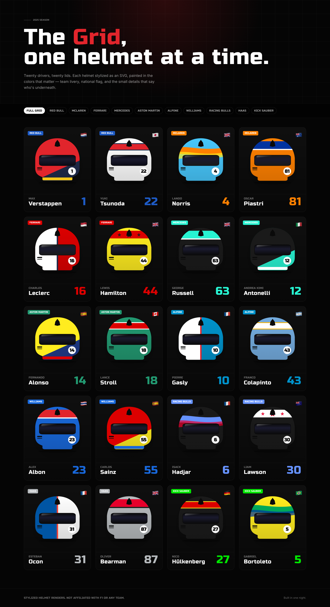

# F1 Helmets: The 2025 Grid


An interactive gallery of the 2025 Formula 1 grid (all 20 drivers across 10 teams) where
every helmet is drawn **procedurally as SVG**, not loaded as an image. Filter by team, hover
for the team-colour glow, and click any helmet for driver details, design notes, and the
exact hex palette.



## Features

- **20 procedurally-rendered helmets.** Each helmet is a single parametric SVG shell with
  one of six pattern types (`topStripe`, `splitDiagonal`, `halfHalf`, `star`, `wave`,
  `centerBand`) painted on top from per-driver colours. No raster assets, so everything
  scales cleanly to any size.
- **Team filtering.** A sticky navbar with "Full Grid" plus all 10 teams; selecting a team
  filters the grid with animated colour highlighting.
- **Driver modal.** Click a helmet for a large render plus name, number, nationality (with
  flag), official team name, the helmet's design notes, and a swatch grid of its four
  colours (primary, secondary, tertiary, visor) with hex codes. `Esc` to close.
- **Colour-driven UI.** Every accent (button backgrounds, modal highlights, hover glow) is
  bound to the team's brand colour from the data, not hardcoded.
- **Responsive and accessible.** Mobile-first 1 to 4 column grid; SVGs carry `role="img"`
  and `aria-label`, the modal closes on backdrop click or `Esc`.

## How the helmets are drawn

The interesting part is `app/components/Helmet.tsx`. Rather than ship 20 PNGs, the app
renders one shared shell path (`SHELL_PATH`) and clips a procedural pattern layer over it.
Patterns are React components selected by a `switch` on the helmet's `pattern` field; the
`star` variant computes a 10-point star with trigonometry (`Math.cos` / `Math.sin`) so it
stays crisp at any resolution. Gradients, the tinted visor, the number badge and the drop
shadow all live in the SVG `defs` and re-render per driver from the data in
`app/data/grid.ts`.

## Tech stack

- **Next.js 16 (App Router) + React 19 + TypeScript**
- **Tailwind CSS v4** with an inline theme
- **Pure SVG** rendering, no Canvas and no image assets
- Google Fonts: Inter (body) and Russo One (display)
- No backend and no runtime dependencies: all 20 drivers and 10 teams are typed data in
  `app/data/grid.ts`

## Run it

```bash
npm install
npm run build && npm start    # open http://localhost:3000
```

> This project uses a customized Next.js whose dev server (`npm run dev`) has a broken
> hot-reload socket. Use `npm run build && npm start` to run it.

## Project layout

```
app/
  page.tsx               # hero + gallery + footer
  components/
    Gallery.tsx          # team filter + helmet grid + modal trigger
    Helmet.tsx           # the procedural SVG helmet renderer (6 patterns)
    DriverModal.tsx      # driver detail modal with colour swatches
  data/
    grid.ts              # 20 drivers, 10 teams, colours, design notes (typed)
```

## Notes

- Helmet designs are original stylised interpretations, not replicas of real 2025 livery.
- The whole grid lives in one typed data file. Add or edit a driver in `app/data/grid.ts`
  and the gallery, filters and modal update automatically.
